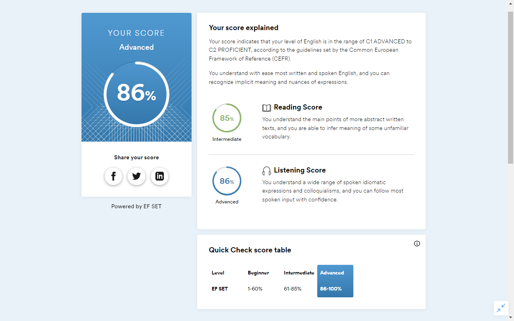

# Inna Yevsieienkova

### Junior Frontend Developer

### Contact information:
**Phone:** +38 050 819 69 04

**E-mail:** evseinka@gmal.com

**Telegram:** YevsInna

### My skills:
* HTML5, CSS3
* JavaScript Basics
* Git, GitHub
* WebStorm, VS Code, Figma

### Code example:
```

```
### Courses:
**OKTEN Web UniversITy**, course «JavaScript Complex» (in progress)   
**RS Schools**, course «JavaScript/Front-end. Stage 0» (in progress)

### Languages:
English - between C1 Advanced and C2 Proficient(according to the online test https://www.efset.org/quick-check/)




Ukrainian - native

Russian - fluently
