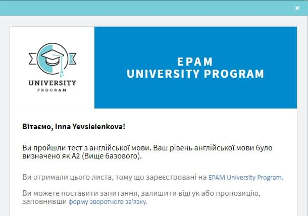

# Inna Yevsieienkova

### Junior Frontend Developer

### Contact information:
**Address:** Ukraine, Vyshhorod

**Phone:** +38 050 819 69 04

**E-mail:** evseinka@gmal.com

**GitHub:** YevsInna

**Telegram:** YevsInna

**About myself:**

I have some experience in banks and government agencies, but now I decided to change my professional direction. IT is completely new to me, I have no commercial experience, so I study hard, practice a lot, and I am confidently going to my goal - to be a strong frontend developer and implement interesting and necessary digital projects.

### My skills:
* HTML5, CSS3
* JavaScript Basics
* Git, GitHub
* WebStorm, VS Code, Figma

### Code example:
```let array = [46,87,0,28,55,-4];
const maxOfArray = (arr) =>{
    let maxNumber = arr[0];
    for (const item of arr) {
        if (item>maxNumber){
            maxNumber=item;
        };
    };
    return maxNumber;
}
maxOfArray(array);
```
### Courses:
**OKTEN Web UniversITy**, course «JavaScript Complex» (in progress)   
**RS Schools**, course «JavaScript/Front-end. Stage 0» (in progress)

### Languages:
English - Pre Intermediate (A2)




Ukrainian - native

Russian - fluently
